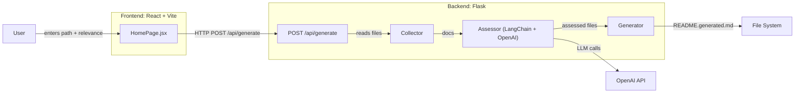

# readmegen

Generate high‑quality README.md files for any local project using a lightweight Flask backend, a React frontend, and LangChain + OpenAI under the hood.

This app:
- Scans a target project folder on your machine
- Uses an LLM to assess which files matter for onboarding and documentation
- Generates a professional README in Markdown and writes it to the target folder as README.generated.md

✨ Great for quickly documenting repos you inherit or refactor.

## Features

- Local file collector with sensible filters (ignores build artifacts, common caches, etc.)
- PII‑aware sanitization for .env-like files (replaces values with placeholders)
- Heuristic size limits and truncation for lock/config files
- LLM-based file assessment (score + include + rationale + summary)
- README generation with optional Mermaid architecture diagram
- Simple React UI to trigger generation and view logs
- REST API for headless usage or scripting

## Architecture

## Project Structure

- app.py — Flask API server exposing POST /api/generate
- readmegen/
  - collector/
    - collector.py — walks the project tree, filters, sanitizes, truncates
    - import_filenames.py — include/skip rules (dirs, extensions, lock files)
  - assessor/
    - assessor.py — LangChain pipeline to rate files and propose summaries
  - generator/
    - readme_generator.py — builds the README from selected context
- frontend/ — React + Vite app (form, logs, preview)
  - src/pages/HomePage.jsx — UI for running generation
  - src/components/ui/* — small UI kit and RHF form components
- requirements.txt — Python dependencies
- .env — environment variable placeholders

## Prerequisites

- Python 3.10+
- Node.js 18+ (for the frontend)
- An OpenAI API key

## Installation

1) Clone and enter the repo:
- git clone <your-fork-or-source>
- cd <repo>

2) Backend (Python):
- python -m venv .venv
- source .venv/bin/activate  # Windows: .venv\Scripts\activate
- pip install -r requirements.txt

3) Frontend (React + Vite):
- cd frontend
- npm install
- cd ..

4) Environment variables:
Create a .env file in the repo root:
- OPENAI_API_KEY=<YOUR_VALUE>
- LANGSMITH_API_KEY=<YOUR_VALUE>       # optional
- LANGSMITH_TRACING=<YOUR_VALUE>       # optional ("true"/"false")

Note: The collector sanitizes .env-like files when reading the target project:
- Keys are kept, values are replaced with <YOUR_VALUE> in prompts.

## Usage

Option A — With UI (recommended) 🙂
1) Start the backend API (default http://localhost:5000):
- source .venv/bin/activate
- python app.py

2) Start the frontend (default http://localhost:5173):
- cd frontend
- npm run dev

3) In the browser:
- Open http://localhost:5173
- Paste the absolute path to the target project folder
- Optionally set a relevance threshold (default: 3)
- Click “Generate README”
- The README will be written to: <target-project>/README.generated.md
- Logs and the generated Markdown are displayed in the UI

Option B — API only (headless)
- POST http://localhost:5000/api/generate
- Body:
  {
    "path": "/absolute/path/to/target/project",
    "relevance": 3
  }
- Response (200):
  {
    "ok": true,
    "out_path": "/abs/target/README.generated.md",
    "logs": ["..."],
    "readme": "...markdown...",
    "selected_paths": ["..."],
    "count_collected": 42,
    "count_selected": 17
  }

Notes
- Files with include=True and score >= relevance are used; otherwise, all collected files are used as fallback.
- The server enforces that path is a directory.

## How it Works

- Collector (readmegen/collector/collector.py)
  - Skips common dirs (node_modules, .git, build, dist, venv, etc.)
  - Includes files by extension (.py, .js/.jsx, .json, .yaml/.yml, .md, .txt, .html, etc.) and key names (requirements.txt, package.json, Dockerfile, etc.)
  - Limits:
    - Per-file bytes: 512 KB
    - Total across repo: 5 MB
    - Lock files truncated to 200 lines; JSON/YAML truncated to 800 lines
  - Sanitizes .env-like files (values replaced with <YOUR_VALUE>)

- Assessor (readmegen/assessor/assessor.py)
  - Uses LangChain + OpenAI to score files 0–5 and recommend include True/False
  - Provides short summary and rationale per file
  - Scoring rubric favors entry points, config, architecture, run/build/deploy docs

- Generator (readmegen/generator/readme_generator.py)
  - Builds a structured prompt with formatted “Source: path + Content”
  - Produces Markdown README
  - Enforces Mermaid diagram formatting rules in the prompt
  - Backend writes the README.generated.md to the target folder

## Configuration Tips

- Model: The code defaults to model="gpt-5" in assessor and generator.
  - If your environment requires a different model, change:
    - readmegen/assessor/assessor.py → ChatOpenAI(model="gpt-5")
    - readmegen/generator/readme_generator.py → default model="gpt-5"
  - Example alternatives: "gpt-4o", "gpt-4o-mini" (adjust per your OpenAI account)

- Relevance threshold: Adjust in the UI or API body ("relevance": 0–5)

- Ignore rules: Tweak readmegen/collector/import_filenames.py to include/exclude more dirs or extensions

## Environment Variables

- OPENAI_API_KEY
- LANGSMITH_API_KEY (optional)
- LANGSMITH_TRACING (optional; e.g., "true" to enable)

Never commit real secrets. The collector sanitizes .env-like content prior to prompting.

## Deployment

No Docker files are included in this repo. Run locally via:
- python app.py for the backend
- npm run dev for the frontend

If you containerize later, expose:
- Backend: 5000/tcp
- Frontend: 5173/tcp (Vite dev) or your chosen static server port after build

## Development

- Python: See requirements.txt
- Frontend:
  - React 19 + Vite 7
  - Tailwind CSS 4 (via @tailwindcss/vite)
  - React Hook Form + zod for validation
  - ESLint config included

Frontend build:
- cd frontend
- npm run build
- npm run preview

## Troubleshooting

- 401/403 from OpenAI: Ensure OPENAI_API_KEY is set and valid
- Model not found: Change model in code to one available to your account
- CORS issues: The backend enables CORS; ensure frontend targets http://localhost:5000
- Path errors: Use an absolute directory path accessible by the backend process
- Empty README: Lower relevance threshold or inspect logs to see what was collected

## License

No license file detected. If you plan to distribute, add a LICENSE to the repository.

Enjoy generating clean READMEs! 🚀