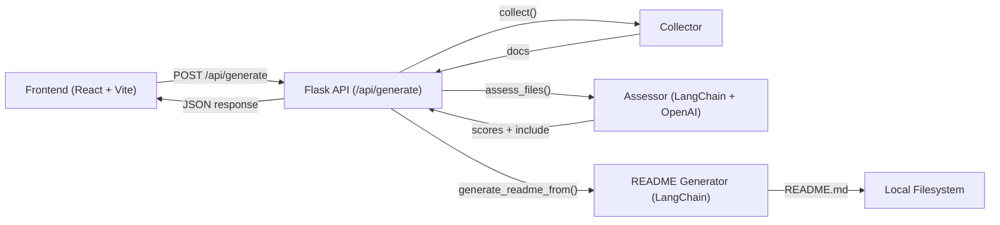

# readmegen — Local README Generator (Flask + React + LangChain)

Generate clean, professional README.md files for any local project folder using a small Flask API, a React UI, and LangChain with OpenAI. Paste a directory path, the app collects and assesses files, then composes a polished README you can save and tweak. ✨

## Features

- Smart file collection with sensible defaults:
  - Skips heavy/irrelevant dirs (node_modules, .git, build, dist, etc.).
  - Truncates very large files and lockfiles; sanitizes .env values.
  - Ignores an existing README when generating a new one.
- File relevance assessment:
  - LLM-based scoring (0–5) with a strict rubric to decide what belongs in the README.
  - Structured output via Pydantic for consistent decisions.
- README generation:
  - Concise, professional Markdown with fenced code blocks and optional Mermaid diagrams.
  - Enforces proper formatting and diagrams that always render.
- Simple local stack:
  - Backend: Flask API with LangChain + OpenAI.
  - Frontend: React + Vite UI with a minimal form.
- Deterministic and safe:
  - Deterministic file traversal order, size caps, and sanitized secrets.

## Tech Stack

- Backend: Python, Flask, LangChain, OpenAI API, Pydantic, python-dotenv
- Frontend: React, Vite, Tailwind (v4), shadcn/ui pieces, React Hook Form + Zod

## Requirements

- Python 3.10+ recommended
- Node.js 18+ (or newer)
- An OpenAI API key

## Installation

1) Clone and set up the backend:

```bash
# from the repository root
python -m venv .venv
# Windows: .venv\Scripts\activate
# macOS/Linux:
source .venv/bin/activate

pip install -r requirements.txt
```

2) Create a .env file in the repo root:

```bash
# .env
OPENAI_API_KEY=<YOUR_VALUE>
# Optional LangSmith tracing (for debugging/observability with LangChain)
LANGSMITH_API_KEY=<YOUR_VALUE>
LANGSMITH_TRACING=<YOUR_VALUE>
```

3) Start the Flask API:

```bash
python app.py
# → serves on http://localhost:5000
```

4) Set up the frontend:

```bash
cd frontend
npm install
npm run dev
# → Vite dev server on http://localhost:5173
```

## Usage

- Web UI (recommended)
  1. Open http://localhost:5173
  2. Paste an absolute path to a project folder on your machine.
  3. Optionally set a Relevance Threshold (default 3).
  4. Click “Generate README”. The generated Markdown appears in the UI and is also written to README.md in that folder.

- API (direct)

```bash
curl -X POST http://localhost:5000/api/generate \
  -H "Content-Type: application/json" \
  -d '{
    "path": "/absolute/path/to/project",
    "relevance": 3
  }'
```

Windows JSON example (escape backslashes):

```bash
curl -X POST http://localhost:5000/api/generate ^
  -H "Content-Type: application/json" ^
  -d "{\"path\": \"C:\\\\Users\\\\you\\\\project\", \"relevance\": 3}"
```

Response (abridged):
- ok: boolean
- out_path: path to README.md
- logs: processing log lines
- readme: generated Markdown
- selected_paths: files used as context
- count_collected / count_selected: counts

## How It Works

- Collector (readmegen/collector):
  - Walks the target repo, skips common build/IDE/vendor dirs.
  - Includes relevant extensions and key files (py/js/ts/toml/json/yaml/md, package.json, requirements.txt, Dockerfile, etc.).
  - Caps per-file size (512 KB) and total bytes (~5 MB).
  - Truncates lock/config files and sanitizes .env values.

- Assessor (readmegen/assessor):
  - Uses LangChain + OpenAI to rate files 0–5 and decide include=True/False based on a strict rubric focused on onboarding value.

- Generator (readmegen/generator):
  - Composes a final README from selected files.
  - Enforces fenced code blocks and strict Mermaid diagram rules.

If no file meets the include=True and score ≥ threshold, the generator falls back to using all collected files.

## Architecture



## Project Structure

```plaintext
.
├─ app.py
├─ requirements.txt
├─ .env                         # your API keys (not committed)
├─ readmegen/
│  ├─ collector/
│  │  ├─ collector.py
│  │  └─ import_filenames.py
│  ├─ assessor/
│  │  └─ assessor.py
│  └─ generator/
│     └─ readme_generator.py
└─ frontend/
   ├─ package.json
   ├─ vite.config.js
   ├─ eslint.config.js
   ├─ jsconfig.json
   └─ src/
      ├─ App.jsx
      ├─ main.jsx
      ├─ pages/
      │  └─ HomePage.jsx
      ├─ index.css
      └─ App.css
```

## Configuration Notes

- Environment variables (root .env):
  - OPENAI_API_KEY
  - LANGSMITH_API_KEY (optional)
  - LANGSMITH_TRACING (optional)

- Model selection:
  - The code currently references model="gpt-5". If your OpenAI account uses different model names, adjust in:
    - readmegen/assessor/assessor.py (ChatOpenAI)
    - readmegen/generator/readme_generator.py (generate_readme_from, write_readme_via_repl)
  - Example replacements: gpt-4o, gpt-4o-mini, o3-mini (as available to your account).

- CORS:
  - Enabled in app.py to allow the Vite dev server to call the Flask API.

## Scripts

Backend:
```bash
# run API
python app.py
```

Frontend:
```bash
# from ./frontend
npm run dev
npm run build
npm run preview
npm run lint
```

## Tips & Troubleshooting

- Paths must be accessible to the backend process. If you run the UI from a different machine/container, ensure the backend has filesystem access to the given path.
- On Windows, escape backslashes in JSON; in the UI you can paste normal paths.
- If “No documents collected”, check your folder path and ignore rules.
- Large repos: the collector stops around 5 MB of gathered text to keep prompts manageable.
- Secrets safety: .env content is sanitized to show only keys.

## License

No license file was found. If you intend to open-source this project, consider adding a LICENSE file (e.g., MIT, Apache-2.0). 🚀