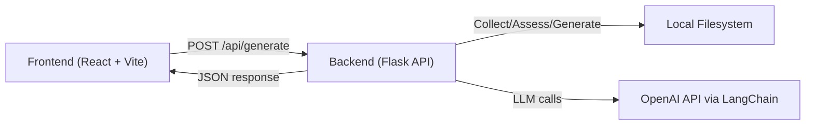

# readmegen

A local, LLM-powered README generator with a Flask backend and a React (Vite) frontend. Point it at any project folder on your machine and it will collect files, assess their relevance, and generate a professional README.md you can preview and save. 🚀

## Features

- LLM-assisted file assessment and selection (via LangChain + OpenAI)
- Clean README generation with project summary, features, setup, usage, and optional diagrams
- Safe collection: sanitizes .env values, truncates large/lock/config files
- Configurable relevance threshold to control which files inform the README
- Fast local UI with logs, preview, and output path
- Simple REST API to integrate into your own tools

## Architecture



## Project Structure

```plaintext
.
├─ app.py
├─ .env                      # put your keys here (values are sanitized in collection)
├─ requirements.txt
├─ readmegen/
│  ├─ assessor/
│  │  └─ assessor.py         # LLM-based file relevance scoring (structured output)
│  ├─ collector/
│  │  └─ collector.py        # safe file collection (sanitizes .env, truncates large files)
│  └─ generator/
│     └─ readme_generator.py # builds README text from selected files
└─ frontend/
   ├─ index.html
   ├─ package.json
   ├─ vite.config.js
   └─ src/
      ├─ App.jsx
      ├─ main.jsx
      └─ pages/
         └─ HomePage.jsx     # UI to submit path, threshold, and preview logs/README
```

## Prerequisites

- Python 3.10+ recommended
- Node.js 18+ and npm (or pnpm/yarn)
- OpenAI API key

## Environment Variables

Create a .env file at the project root (do not commit secrets):

```bash
OPENAI_API_KEY=<YOUR_VALUE>
LANGSMITH_API_KEY=<YOUR_VALUE>   # optional
LANGSMITH_TRACING=<YOUR_VALUE>   # optional (e.g., "true")
```

Only the keys are needed; values remain private. The collector automatically replaces any .env values with <YOUR_VALUE> when building prompts.

## Installation

Backend (Flask + LangChain):

```bash
# from project root
python -m venv .venv
# Windows: .venv\Scripts\activate
# Unix/Mac: source .venv/bin/activate
pip install --upgrade pip
pip install -r requirements.txt
```

Frontend (React + Vite + Tailwind):

```bash
# from project root
cd frontend
npm install
```

## Usage

Run the backend API:

```bash
# from project root (with venv activated)
python app.py
# serves at http://localhost:5000
```

Run the frontend:

```bash
# in a new terminal
cd frontend
npm run dev
# opens http://localhost:5173
```

Open the UI at http://localhost:5173, paste the absolute path to the project you want to document (e.g., C:\Users\you\my-project or /Users/you/my-project), optionally set the relevance threshold, and click “Generate README”.

### API (direct)

You can call the API without the frontend:

```bash
curl -s http://localhost:5000/api/generate \
  -H "Content-Type: application/json" \
  -d '{
    "path": "/absolute/path/to/your/project",
    "relevance": 3
  }' | jq .
```

- Request body:
  - path: absolute path to the target project folder
  - relevance: integer threshold (default 3). Files with include=true and score >= relevance are used. If none selected, it falls back to all collected files.
- Response (success):
  - ok: true
  - out_path: written README file path
  - logs: pipeline logs
  - readme: generated README content
  - selected_paths: files that informed the README
  - count_collected, count_selected

## How it works

- Collection (readmegen/collector/collector.py)
  - Skips common bulky/irrelevant directories (via import_filenames constants)
  - Sanitizes .env files (replaces values with <YOUR_VALUE>)
  - Truncates lock files and large config files to keep prompts small
  - Enforces per-file and total corpus size limits

- Assessment (readmegen/assessor/assessor.py)
  - Uses a rubric to score each file 0–5 and decide include=true/false
  - Produces structured output (Pydantic BaseModel) with a short summary and reason
  - Batches requests for speed

- Generation (readmegen/generator/readme_generator.py)
  - Formats selected docs into a single context block
  - Produces a well-structured README with code blocks and an optional Mermaid diagram

## Configuration

- Model: The code references "gpt-5" by default. You may wish to set a real, available model (e.g., gpt-4o, gpt-4o-mini) in:
  - readmegen/assessor/assessor.py (ChatOpenAI(model="..."))
  - readmegen/generator/readme_generator.py (generate_readme_from(model="..."))
- Threshold: Adjust relevance (0–5). Default is 3. Higher means fewer, more critical files inform the README.
- Limits: Update MAX_FILE_BYTES, MAX_TOTAL_BYTES, LOCK_MAX_LINES, CONFIG_MAX_LINES in collector.py for larger repos.

## Troubleshooting

- 401/403 from OpenAI: Ensure OPENAI_API_KEY is set and active.
- “Path is not a directory”: Provide a valid absolute folder path.
- “No documents collected”: Your ignore rules or limits might exclude everything—try lowering thresholds or adjusting collector limits.
- CORS errors: Ensure the backend (http://localhost:5000) is running; CORS is enabled in app.py.
- Port conflicts: Change ports in app.py or Vite config if needed.
- Windows paths: Use escaped backslashes in JSON (e.g., "C:\\\\Users\\\\you\\\\project") or forward slashes.

## Development Notes

- Backend server: Flask with CORS in app.py
- Frontend server: Vite dev server; React 19, Tailwind CSS 4
- The README is written to the root of the target project as README.md
- Logs show collection count, selected files, and output path for easy debugging

## Example Commands

Generate a README for this repository itself (adjust path):

```bash
curl -s http://localhost:5000/api/generate \
  -H "Content-Type: application/json" \
  -d '{
    "path": "/absolute/path/to/readmegen",
    "relevance": 3
  }'
```

## License

No license file detected. Add a LICENSE file if you plan to share or open-source this project. 📄

---

Happy documenting! 🧠✨