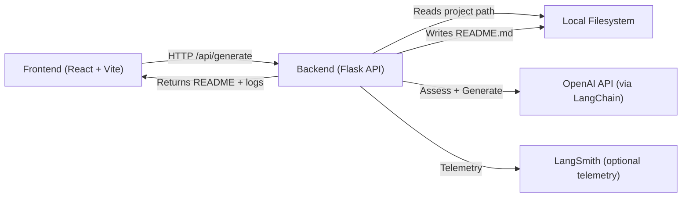

# readmegen — AI-powered README Generator

The following is create by https://github.com/Herc-Ch/readme-generator

Generate clear, professional README.md files for any local project using a Flask backend, a React (Vite) frontend, and OpenAI via LangChain. Point the app at a folder on your machine, and it will collect key files, assess their relevance, and synthesize a polished README — then write it back to that folder. 🚀

## Features

- Automatic file collection with safe rules (ignores heavy/lock directories, truncates large configs, sanitizes .env values)
- LLM-based relevance scoring for each file (what matters most for setup, run, and deploy)
- README generation with sensible sections, Mermaid diagrams, and copyable command snippets
- Web UI for easy use, plus a simple REST API
- Dockerized backend and frontend for easy startup
- Local filesystem write-back to README.md in your target project folder

## Architecture



## Project Structure

```plaintext
.
├─ app.py                         # Flask API (POST /api/generate)
├─ requirements.txt               # Python dependencies
├─ Dockerfile                     # Backend (Flask) container
├─ docker-compose.yml             # Orchestrates API + Web
├─ .env                           # Environment keys (no secrets committed)
├─ readmegen/
│  ├─ assessor/
│  │  └─ assessor.py              # LLM-based file relevance scoring
│  ├─ collector/
│  │  ├─ collector.py             # Walks repo, applies include/skip/truncate rules
│  │  └─ import_filenames.py      # Filenames and directory rules
│  └─ generator/
│     └─ readme_generator.py      # README generation pipeline
└─ frontend/
   ├─ Dockerfile                  # Builds Vite app, serves via Nginx
   ├─ package.json                # Frontend deps/scripts
   ├─ vite.config.js              # Vite config
   └─ src/
      ├─ App.jsx
      ├─ main.jsx
      └─ pages/
         └─ HomePage.jsx          # UI to submit path + threshold and view result
```

## Prerequisites

- Docker and Docker Compose (for containerized run), or:
- Python 3.11+ (backend), Node.js 20+ (frontend)
- An OpenAI API key with access to your chosen model

Note: The code currently references the model name "gpt-5" as a placeholder. Adjust it to a model available to your account (e.g., gpt-4o, gpt-4o-mini) in:
- readmegen/assessor/assessor.py
- readmegen/generator/readme_generator.py

## Environment Variables

Create a `.env` file in the project root:

```bash
OPENAI_API_KEY=<YOUR_VALUE>
LANGSMITH_API_KEY=<YOUR_VALUE>
LANGSMITH_TRACING=<YOUR_VALUE>
```

- OPENAI_API_KEY — required for LLM calls
- LANGSMITH_API_KEY — optional (telemetry/tracing)
- LANGSMITH_TRACING — optional (e.g., "true" to enable)

Secrets are never printed; .env values are sanitized during collection.

## Quick Start (Docker)

```bash
# 1) Create .env with your keys
cp .env .env.local  # or edit .env directly

# 2) Build and start
docker compose up --build
```

- Backend API: http://localhost:5000
- Frontend UI: http://localhost:5173

The frontend calls the backend at http://localhost:5000/api/generate.

To stop:
```bash
docker compose down
```

## Local Development

Backend (Flask):
```bash
# From repo root
python -m venv .venv
source .venv/bin/activate          # Windows: .venv\Scripts\activate
pip install -r requirements.txt

# Ensure .env has OPENAI_API_KEY, etc.
python app.py
# → Flask API runs on http://localhost:5000
```

Frontend (Vite + React):
```bash
cd frontend
npm install
npm run dev
# → Open http://localhost:5173
```

The UI will send POST requests to http://localhost:5000/api/generate.

## Usage

### Via Web UI
1. Start backend and frontend (Docker or local).
2. Open http://localhost:5173.
3. Paste a local project folder path (e.g., C:\Users\you\project or /Users/you/project).
4. Choose a relevance threshold (recommended: 3).
5. Click “Generate README”. The app:
   - Collects files with safe rules
   - Scores relevance and selects key files
   - Generates README
   - Writes README.md into the provided project folder
   - Shows logs and the rendered README

### Via API (cURL)
```bash
curl -sS -X POST http://localhost:5000/api/generate \
  -H "Content-Type: application/json" \
  -d '{
    "path": "/absolute/path/to/your/project",
    "relevance": 3
  }' | jq
```

Request body:
- path: absolute path to a local folder
- relevance: integer (default 3). Files with score > relevance and include=true are used. If none qualify, all files are used as fallback.

Response fields:
- ok: boolean
- out_path: full path to README.md written
- logs: step-by-step messages
- readme: generated Markdown content
- selected_paths: which files influenced the README
- count_collected / count_selected: stats

## How It Works (Under the Hood)

- Collector (readmegen/collector/collector.py)
  - Skips heavy/irrelevant dirs (node_modules, .git, build, etc.)
  - Includes important config and source extensions
  - Truncates lock/config files and sanitizes .env values
- Assessor (readmegen/assessor/assessor.py)
  - Uses an LLM to score each file 0–5 and decide include=true/false
- Generator (readmegen/generator/readme_generator.py)
  - Formats selected snippets and prompts the LLM for a structured README
  - Enforces fenced code blocks and Mermaid diagram rules
- Backend (app.py)
  - POST /api/generate orchestrates the flow and writes README.md

## Configuration Tips

- Adjust the LLM model:
  - readmegen/assessor/assessor.py → ChatOpenAI(model="...") for assessment
  - readmegen/generator/readme_generator.py → ChatOpenAI(model="...") for generation
- Tune collection limits in readmegen/collector/collector.py:
  - MAX_FILE_BYTES, MAX_TOTAL_BYTES, LOCK_MAX_LINES, CONFIG_MAX_LINES
- Update skip/include rules in readmegen/collector/import_filenames.py

## Deployment

- Docker images provided for both services:
  - Backend: Python 3.11-slim, runs Flask on port 5000
  - Frontend: Node build → Nginx serves static files on port 80 (mapped to 5173)
- docker-compose.yml wires them together and mounts the repo for dev-friendly backend iteration

To run detached:
```bash
docker compose up -d --build
```

To tail logs:
```bash
docker compose logs -f
```

## Troubleshooting

- Model access errors: Change "gpt-5" to a model available to your account (e.g., gpt-4o or gpt-4o-mini).
- Permission/path issues on write: Ensure the backend container/user can access the host path and that you provide an absolute path.
- Empty collection: Check ignore rules and confirm the path points to a directory with supported file types.

---

Made with ❤️ to save time on docs and help teams ship faster.
